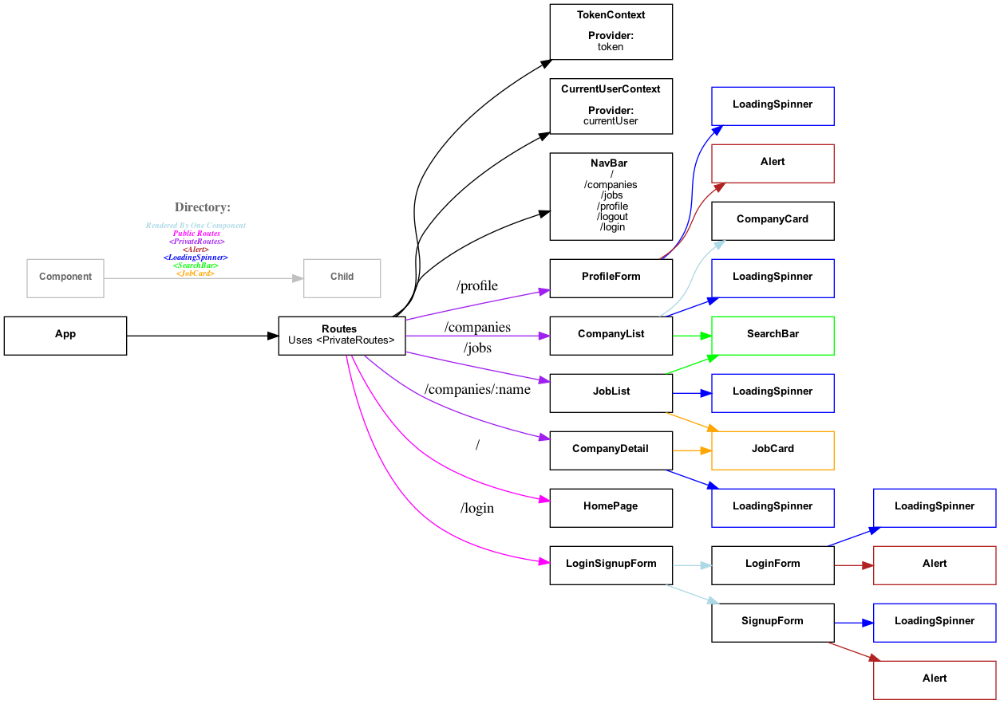

## Getting started with Jobly's frontend

1. Clone this repo and `cd` into `react-jobly-frontend`
2. `npm install`
3. `npm start`

## Getting started with Jobly's backend

1.  Clone this repository and `cd` into `backend`
2.  `createdb jobly`
2.  `psql jobly < data.sql`
3.  `npm install`
4.  `npm start`

# Jobly, a site to find jobs!
* Jobly was built with React on the frontend paired with Express and PostgreSQL on the backend.
* Has a login/register and logout feature. When logged in The user can see a list of companies hiring as well as a list of jobs to apply to.
* The user also has a profile page where they can see their profile information as well as edit their profile.
* Jobly's express backend uses a jsonwebtoken to ensure a user is logged in otherwise they cannot see the companies, jobs, or profile page. It also uses that token to ensure the user logged in is the user sending a specific requests, for example: the PATCH request to edit a user's profile page.
* Jobly's backend also makes use of jsonschema to validate forms before any information is sent and saved to the database. Jobly's frontend stores the JWT in localStorage to authenticate and authorize the user logging in.

## Frontend Component Hierarchy

[Live App Demo](https://jolly-bartik-93b7c7.netlify.app/)